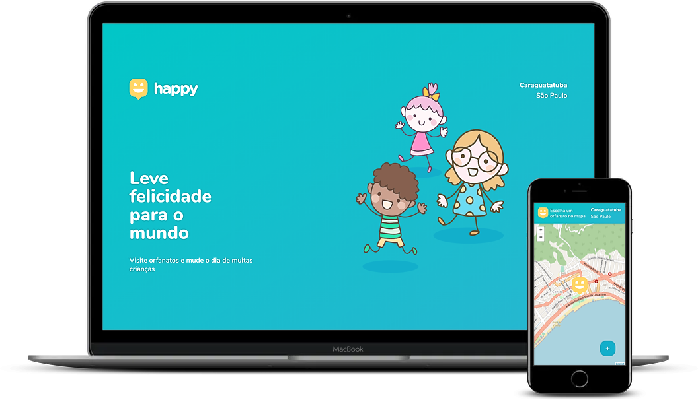

<h1 align="center">
NLW #3 - Happy with Vue
</h1>

<h1 align="center">
    
</h1>

  <a href="#-projeto">Projeto</a>&nbsp;&nbsp;&nbsp;|&nbsp;&nbsp;&nbsp;
  <a href="#-diferencas">Qual a diferença pro projeto original?</a>&nbsp;&nbsp;&nbsp;|&nbsp;&nbsp;&nbsp;
  <a href="#-tecnologias">Tecnologias</a>

## 💻 Projeto

Este é um projeto desenvolvido durante a **[Next Level Week](https://nextlevelweek.com/)**, realizada pela **[@Rocketseat](https://github.com/Rocketseat)** durante os dias 12 a 18 de Outubro de 2020.

## 🤔 Diferenças

Este projeto não foi feito como na Next Level Week, mas baseado, usando Vue no lugar do React e sem a versão mobile inicialmente, mas com o front-end sendo responsivo e instalável em celulares.

## 🚀 Tecnologias

Esse projeto foi desenvolvido utilizando as seguintes tecnologias:

- [Node.js](https://nodejs.org/en/)
- [TypeScript](https://www.typescriptlang.org/)
- [Express](https://expressjs.com/pt-br/)
- [SQLite](https://www.sqlite.org/index.html)
- [TypeORM](https://typeorm.io/#/)
- [Yup](https://github.com/jquense/yup)
- [Vue](https://vuejs.org/)
- [TailwindCSS](https://tailwindcss.com/)
- [Axios](https://github.com/axios/axios)

---

Desenvolvido com 💚 por Vitor "Pliavi" Silvério

Este README é baseado no original  do <a href="https://github.com/guilhermecapitao/nlw3-discovery-happy">Guilherme Capitão</a>
